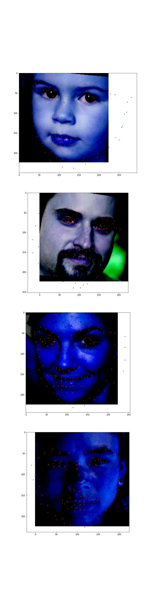

# Facial landmarks detection


## Overview
Facial keypoints detection using convolutional neural networks implemented in Pytorch.

## Dataset
The dataset used in this project is an offcial DLIB dataset which consists of over 6666 image of different dimensions, the dataset can be downloaded [here](http://dlib.net/files/data/ibug_300W_large_face_landmark_dataset.tar.gz).


## Install  dependencies

  ```python
  pip install -r requirements.txt
  ```

## Model

The landmark detection is a regression problem, the model consists of a customized version of efficientnet-b0 backbone, I further added 2 fully connected layers with a customized number of outputs(136)

Run the script main.py to see the training options.

### Training 

1. Run download.sh script for data preparation.
2. start the main training script main.py.

### example 
  ```sh
  $./build.sh

  $python main.py
  ```

 
## Performance 
| Loss            | MSE |
|-----------------|---------|
| training loss      |   0.052      |   
| valdiation loss |    0.028   |
## Evaluating the model on the test set

The model is automatically trained after completing the training. The model is saved in "./saved" directory. To Evaluate the Model run the script 
. 

  ```python  
  python evaluate.py --/path/to/saved/model
   ```


visualization of the model prediction on the validation set. (green is the ground truth and red is the predicted keypoints)

<p align="center"></p>

